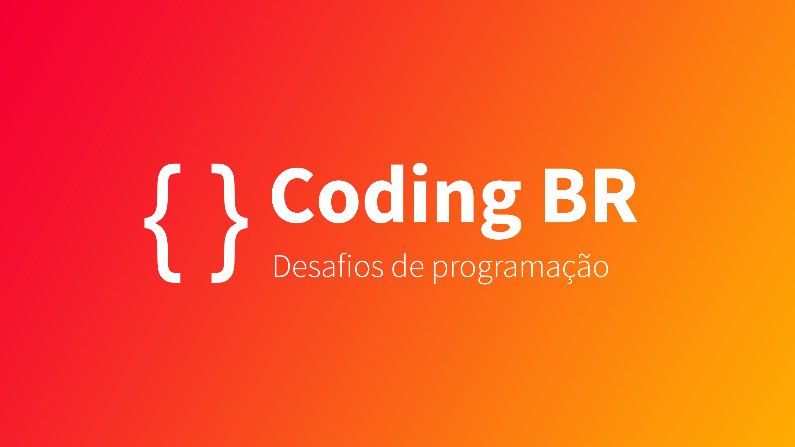

## :books: Estude conosco

Esse repositório nasceu para guardar todas as propostas de desafios
do server Coding BR da Discord. O objetivo é auxiliar pessoas programadoras
a se manterem motivadas durante a processo de aprendizagem.

Cada desafio colabora para:

- Consolidar e aperfeiçoar conceitos de programação;
- Oportunidade de experimentar novas ferramentas;
- Desenvolver proatividade e empatia;
- Elevar a percepção de progresso;
- Construir um bom portfólio.

### Como funciona?
Semanalmente um ou mais desafios serão escolhidos afim de trabalhar um conjunto de habilidades específicas.
Os participantes farão os desafios individualmente, mas a comunidade estará disponível para auxiliar sempre
que alguma dificuldade for encontrada.

## :fire: Desafios

### Nível 1 - Iniciante
|       Nome      | Linguagens  | Descrição                                            | Status                |
|---------------|:------------:|------------------------------------------------------|:-----------------------:|
| Simple page 01 |    HTML    | Uma página simples utilizando apenas HTML.| Feito |
| Simple page 02 |    HTML    | Um site com três páginas com os elementos do HTML mais utilizados.| Feito |
| [Status box](./projetos/status.md) | HTML e CSS | Um input para o usuário postar pensamentos e ideias.| Feito |
| [Login](./projetos/login.md) | HTML e CSS | Uma página para login do usuário no serviço.| Feito|
| [Sign up](./projetos/inscricao.md) | HTML e CSS | Formulário para criar uma conta no site.| Feito |
| [Dark mode](./projetos/dark-mode.md) | HTML, CSS e JS | Um menu lateral flexível com dois modos de cores.| Feito |
| [Clone UK Gov](./projetos/clone-uk-gov.md) | HTML, CSS e JS | Um clone do site do governo do Reino Unido| Feito |
| [Trivia game](./projetos/trivia-game.md) | HTML, CSS e JS | Um jogo de perguntas e respostas sobre programação| Ativo |
| [Tic tac toe](./projetos/tic-tac-toe.md) | HTML, CSS e JS | O clássico jogo da velha agora digital| Ativo |
